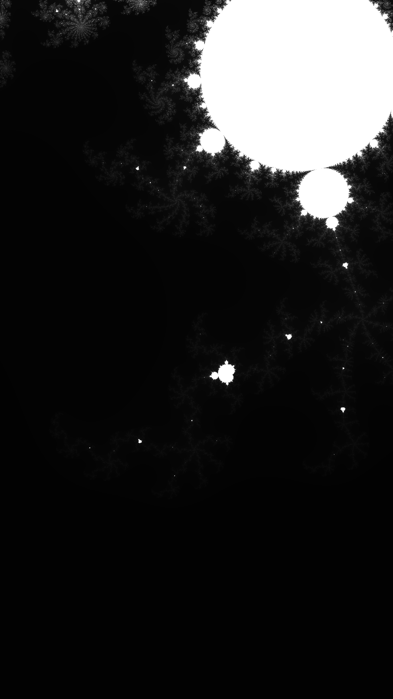

# Images

## Dependencies

We're going to make use of colours from the `palette` crate:

```shell
cargo add image
cargo add palette
```

## Add colour

Add a new file called [`colour.rs`](./src/colour.rs) to the `src` directory:

```shell
touch src/colour.rs
```

Inside it add the following code:

```rust
/// Convert a hex colour string to an RGB tuple.
fn hex_to_rgb(hex: &str) -> (f32, f32, f32) {
    let hex = hex.trim_start_matches('#');

    let hex_val: u32 = (u32::from_str_radix(hex, 16).ok()).unwrap();

    let red = ((hex_val >> 16) & 0xFF) as f32 / 255.0;
    let green = ((hex_val >> 8) & 0xFF) as f32 / 255.0;
    let blue = (hex_val & 0xFF) as f32 / 255.0;

    (red, green, blue)
}

/// Convert a 2D array of integers to an RGB image array.
pub fn image(data: Array2<u16>, cols: Vec<&str>, max_iter: u16) -> Array3<u8> {
    let cs: Vec<_> = cols
        .iter()
        .map(|col| {
            let (r, g, b) = hex_to_rgb(col);
            LinSrgb::new(r, g, b)
        })
        .collect();
    let cmap: Gradient<LinSrgb> = Gradient::new(cs);

    let mut cols = Array3::<u8>::zeros((data.shape()[0], data.shape()[1], 3));
    let max_inv = 1.0 / max_iter as f32;
    let (width, height) = data.dim();
    for yi in 0..height {
        for xi in 0..width {
            let col = cmap.get(data[(xi, yi)] as f32 * max_inv);
            let u8s: [u8; 3] = col.into_format().into_raw();
            cols.slice_mut(s![xi, yi, ..]).assign(&arr1(&u8s));
        }
    }

    cols
}

/// Encode an RGB image array as an image.
pub fn encode(arr: &Array3<u8>) -> RgbImage {
    let img = transpose(&arr);
    let (width, height, _) = img.dim();

    RgbImage::from_vec(
        height as u32,
        width as u32,
        img.view().as_slice().unwrap().to_vec(),
    )
    .expect("Container should have the right size for the image dimensions.")
}

/// Transpose an RGB image array, fipping it along the diagonal.
pub fn transpose(arr: &Array3<u8>) -> Array3<u8> {
    let (width, height, _) = arr.dim();
    let mut buffer = Array3::zeros((height, width, 3));

    for n in 0..(width * height) {
        let xi = n % width;
        let yi = n / width;
        buffer
            .slice_mut(s![yi, xi, ..])
            .assign(&arr.slice(s![xi, yi, ..]));
    }

    buffer
}
```

## Link

Link the new module to the rest of the crate by adding the following to the top of the `lib.rs` file:

```rust
pub mod colour;
```

## Main

Update the [`main.rs`](./src/bin/main.rs) main function to use the `image()` function, and save the image to a file:

```rust
use std::{fs::create_dir, path::Path};

use mandy::{colour, sample};

/// Entry point function.
fn main() {
    let output_dir = Path::new("output");
    if !output_dir.exists() {
        create_dir("output").unwrap();
    }

    let real = 0.42883258532;
    let imag = -0.23134912185;
    let scale = 1.0e-1;
    let max_iters = 1000;
    let res = [1920, 1080];
    let cmap = vec!["#000000", "#FFFFFF"];

    let data = sample::area(real, imag, scale, res, max_iters);
    let mut img = colour::image(data, cmap, max_iters);
    colour::encode(&mut img)
        .save(output_dir.join("mandy.png"))
        .unwrap();
}
```

## Try it

Execute the program with:

```shell
cargo run --bin main --release
```

You should see a new file in the `output` directory called `mandy.png`:



## Return

[Return to the top-level README](./../../README.md)
