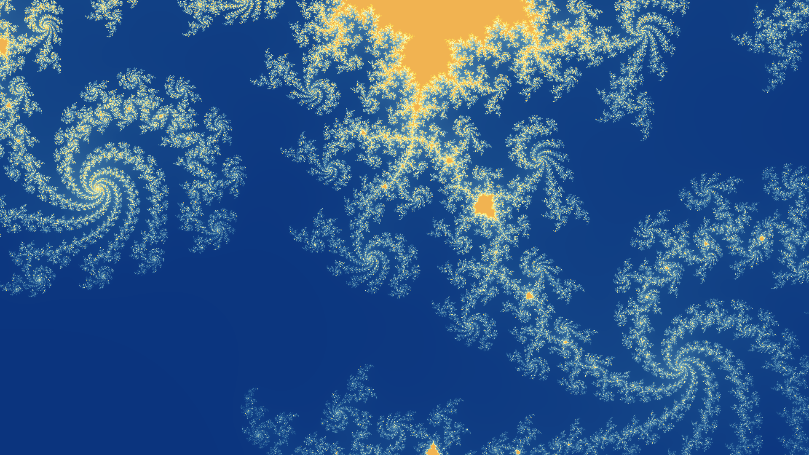

# Progress Bar

Let's add a progress bar to our program.

## Add Dependencies

Add `indicatif`, a progress bar library:

```shell
cargo add indicatif
```

## Edit sample

Replace the contents [`sample.rs`](src/bin/sample.rs) `area` function to with this such that it creates and iterates the progress bar:

```rust
use indicatif::ProgressBar; // Add this line to the top of the file.

/// Sample a region of the Mandelbrot set.
pub fn area(real: f64, imag: f64, scale: f64, res: [usize; 2], max_iters: u16) -> Array2<u16> {
    let mut data = Array2::zeros((res[0], res[1]));

    let aspect_ratio = res[0] as f64 / res[1] as f64;
    let real_start = real - (scale * 0.5);
    let imag_start = imag - (scale / aspect_ratio * 0.5);

    let delta = scale / (res[0] - 1).max(1) as f64;

    let total_pixels = (res[0] * res[1]) as usize;
    let pb = ProgressBar::new(total_pixels as u64);
    for n in 0..total_pixels {
        let xi = n % res[0];
        let yi = n / res[0];

        let imag = imag_start + (delta * yi as f64);
        let real = real_start + (delta * xi as f64);
        data[(xi, yi)] = point(real, imag, max_iters);

        pb.inc(1);
    }

    data
}
```

## Try it out

Then run the program with the following command:

```shell
cargo run --bin main --release -- --real 0.39 --imag 0.235 --scale 1.0e-2 --max-iters 400 --width 1920 --height 1080 --cmap 062B79 16498A 5995B7 FAFBBD FDE050 F1B351 FFBB00
```

You should see a progress bar as the plot is rendered.
When it finishes, you should see an image like the following:



## Return

[Return to the top-level README](./../../README.md)
