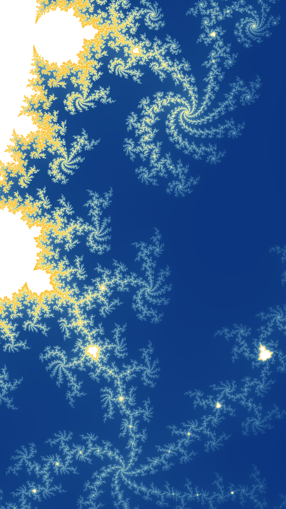

# Super Sampling

Our image gets jagged edges in locations near the boundary, as the number of iterations required can vary wildly over a very small length scale.
We can mitigate this by sampling multiple points in each pixel and taking the average of the results.

## Sample

Add the following code to [`sample.rs`](./src/sample.rs):

```rust
/// Sample a small square region of the mandelbrot set and
/// return the average number of iterations required to escape a circle of radius 2.0.
fn super_sample(real: f64, imag: f64, max_iters: u16, delta: f64, ss_power: u8) -> u16 {
    let mut sum = 0;
    let epsilon = delta / ss_power as f64;

    let total_samples = ss_power * ss_power;
    for n in 0..total_samples {
        let i = n % ss_power;
        let j = n / ss_power;

        let re = real + (epsilon * i as f64);
        let im = imag + (epsilon * j as f64);
        sum += point(re, im, max_iters);
    }
    sum / total_samples as u16
}
```

And update the `area` function so that it takes an additional `power` argument, and calls `super_sample` instead of `point`:

```rust
/// Sample a region of the Mandelbrot set.
pub fn area(
    real: f64,
    imag: f64,
    scale: f64,
    res: [usize; 2],
    max_iters: u16,
    ss_power: u8,
) -> Array2<u16> {
    let mut data = Array2::zeros((res[0], res[1]));

    let aspect_ratio = res[0] as f64 / res[1] as f64;
    let real_start = real - (scale * 0.5);
    let imag_start = imag - (scale / aspect_ratio * 0.5);

    let delta = scale / (res[0] - 1).max(1) as f64;

    let total_pixels = (res[0] * res[1]) as usize;
    let pb = ProgressBar::new(total_pixels as u64);
    for n in 0..total_pixels {
        let xi = n % res[0];
        let yi = n / res[0];

        let imag = imag_start + (delta * yi as f64);
        let real = real_start + (delta * xi as f64);
        data[(xi, yi)] = super_sample(real, imag, max_iters, delta, ss_power);

        pb.inc(1);
    }

    data
}
```

## Main

Update the `Args` structure in [main.rs](./src/bin/main.rs) so that it includes a `ss_power` argument:

```rust
...
    #[arg(short, long, default_value = "1")]
    ss_power: u8,
...
```

Which we'll then pass to the `area` function in `main`:

```rust
...
    let data = sample::area(
        args.real,
        args.imag,
        args.scale,
        [args.width, args.height],
        args.max_iters,
        args.ss_power,
    );
...
```

## Try it

Then run the program with the following command:

```shell
cargo run --bin main --release -- --real 0.399 --imag 0.235 --scale 2.0e-2 --max-iters 400 --ss-power 3 --width 1920 --height 1080 --cmap 062B79 16498A 5995B7 FAFBBD FDE050 F1B351 FFBB00 FFFFFF
```

You should see a progress bar as the plot is rendered.
When it finishes, you should see an image like the following:



## Return

[Return to the top-level README](./../../README.md)
